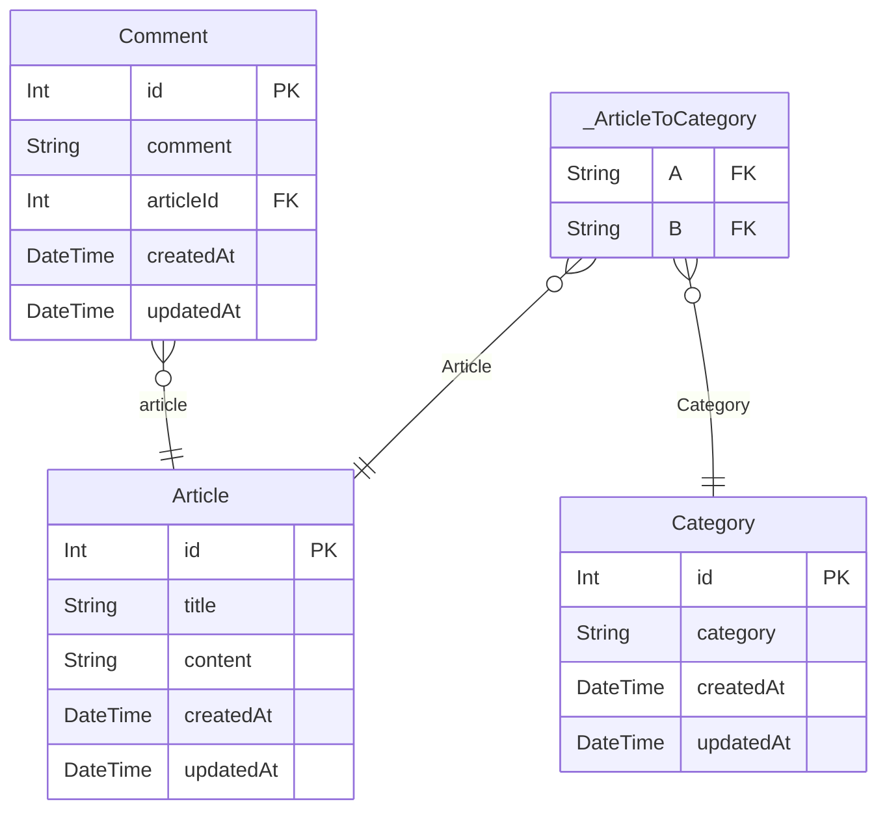

# ER図

> Generated by [`prisma-markdown`](https://github.com/samchon/prisma-markdown)

- [default](#default)

## default

### `Article`

Properties as follows:

- `id`:
- `title`:
- `content`:
- `createdAt`:
- `updatedAt`:

### `Comment`

Properties as follows:

- `id`:
- `comment`:
- `articleId`:
- `createdAt`:
- `updatedAt`:

### `Category`

Properties as follows:

- `id`:
- `category`:
- `createdAt`:
- `updatedAt`:

### `_ArticleToCategory`

Pair relationship table between [Article](#Article) and [Category](#Category)

Properties as follows:

- `A`:
- `B`:
